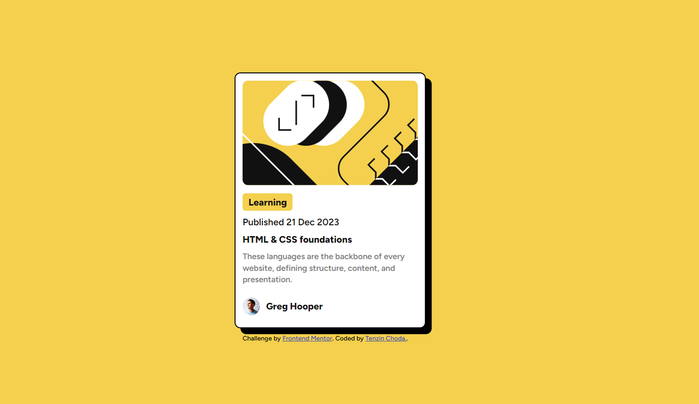
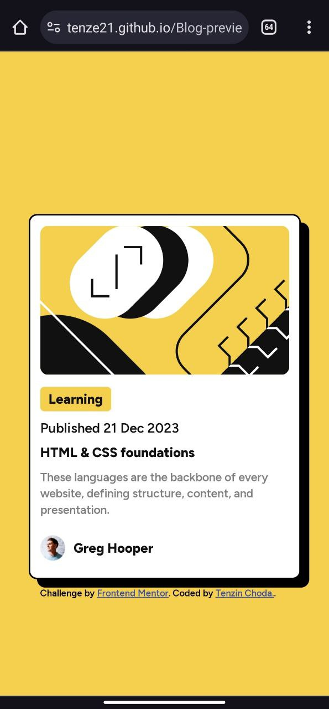

# Frontend Mentor - Blog preview card solution

This is a solution to the [Blog preview card challenge on Frontend Mentor](https://www.frontendmentor.io/challenges/blog-preview-card-ckPaj01IcS). Frontend Mentor challenges help you improve your coding skills by building realistic projects. 

## Table of contents

- [Overview](#overview)
  - [The challenge](#the-challenge)
  - [Screenshot](#screenshot)
  - [Links](#links)
- [My process](#my-process)
  - [Built with](#built-with)
  - [What I learned](#what-i-learned)
- [Author](#author)
- [Acknowledgments](#acknowledgments)

## Overview
I have designed the blog preview card from the front end mentor challenge. I have also used hover effect on the profile picture so that viewers can view it clearly if they want to. You think it's useful?

### The challenge

Users should be able to:

- See hover and focus states for all interactive elements on the page

### Screenshot
## You can checkout my work below 😊.
- The desktop design.

- The mobile design.

- The hover effect.

### Links

- Solution URL: checkout my solution on frontend mentor [here]()
- Live Site URL: checkout the livesite [here](https://tenze21.github.io/Blog-preview-card-frontend-mentor/)

## My process
for this project i have used a bit of CSS grid to make myself familiar with it since it's been long since I last used it at college.

### Built with

- Semantic HTML5 markup
- CSS custom properties
- Flexbox
- CSS Grid

### What I learned
Here I realized that we can use the CSS properties **align-items** and **justify-content** with grid.

## Author

- Website - [Tenzin Choda](https://tenze21.github.io/Blog-preview-card-frontend-mentor/)
- Frontend Mentor - [tenze21](https://www.frontendmentor.io/profile/tenze21)

## Acknowledgments
I am grateful to the frontend mentor team for this awesome project.
